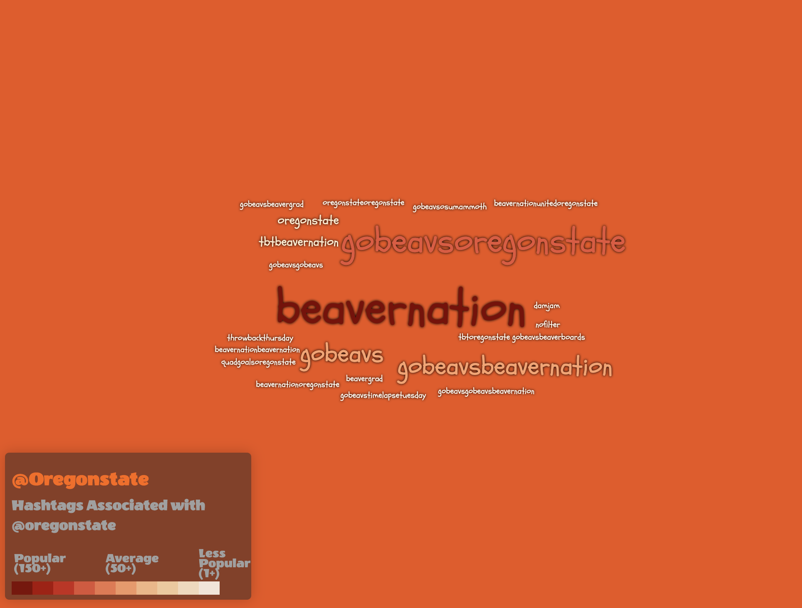
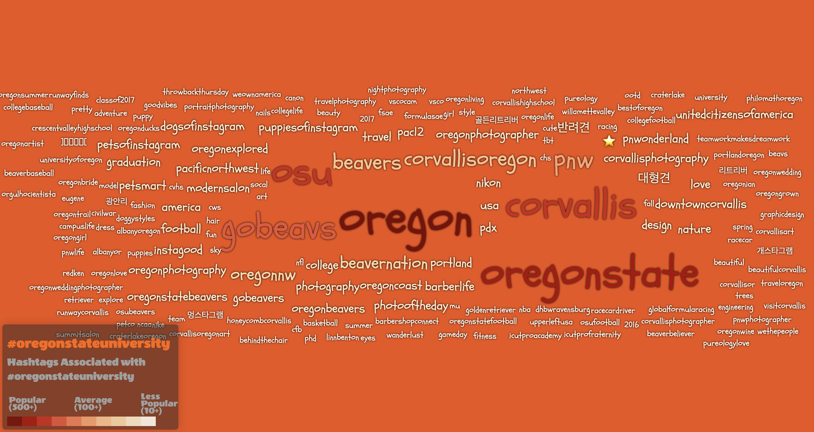
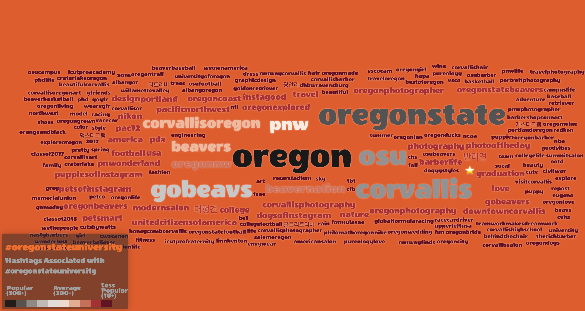
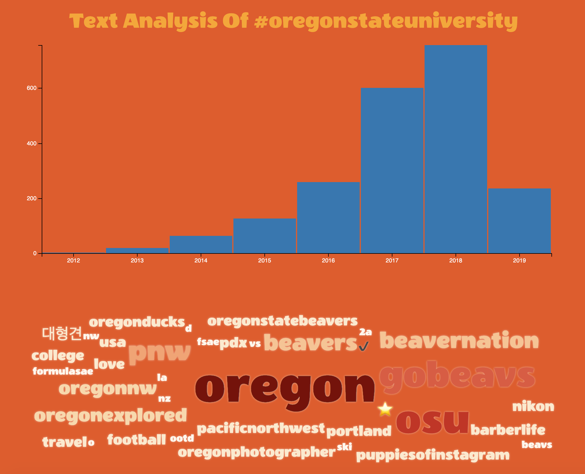

# [Wordcloud - Using Hashtags](https://loweas.github.io/wordcloud/)
Hashtags make a perfect media for designing and making a wordcloud

This world cloud uses [jQCloud](http://mistic100.github.io/jQCloud/demo.html) library.

* **Extension of Bo Zhao [WordCloud Repository](https://github.com/jakobzhao/geog4572/blob/master/lectures/lec12/readme.md)**

## Get Social Media Data
There a bunch of different ways to get social media data, API of the social media site, web scrapers plugins like [WebScraper](https://www.webscraper.io/documentation) or non-API driven python scripts you can find in repositories on GitHub. An API will give you a more dynamic interface but depending on the site you are using are becoming more restictive due to privacy issues. For this example, I used this [Instagram Scraper](https://github.com/rarcega/instagram-scraper).

## Example [@oregonstate](https://www.instagram.com/oregonstate/)
When using hashtags the entire hashtag is  the main focus which reduces the amount of code/splicing needed to parse out the words.

This example uses the account @oregonstate, which we can see does not actively use that many hashtags.

## Example 2 [#oregonstateuniversity](https://www.instagram.com/explore/tags/oregonstateuniversity/)
This hashtag contains more than 11MB of information. Atom has a hard time loading large files. First you will need to clean up the json file. Converting a Json file to CSV will reduce the size. Located in :

      /assets/demo.py

Is a python script you can use to convert json files to csv. More information on this process is located [here](https://www.kaggle.com/jboysen/quick-tutorial-flatten-nested-json-in-pandas):

      import json
      import pandas as pd
      from pandas.io.json import json_normalize

      with open('name-of-file.json', encoding='utf-8-sig') as f:
      data = json.load(f)

      df = json_normalize(data)

      df.to_csv('name-of-file.csv', encoding='utf-8', index=False)

* Change the **name-of-file** to which file you want to convert.

Run this script in your terminal!

#### Still to BIG!
To reduce even further deleting I deleted unneeded columns in Excel. The file now only contains tags and it is still to big!

We need to reduce even futher. To do this you'll needed to decide what information do you want to convey? If you decided on keeping only the most recent post then you won't be able to do yearly timeseries visualization. If you base it off of the most popular post within the time periods you'll be able to keep that ability.

I personally think that we should sort the photos by using the photos in the 90th precentile based on likes. This diminstrates photos with large engagement, capturing the "Influencers."

#### Reducing in RStudio
By taking the distrubution of likes and creating a new dataframe with only the top 10 percentile based off those likes will reduce your dataframe. It will also allow you to keep other columns in your dataset (timestamp, #likes, url..etc).

**_But_** even though this does reduce the size of your dataframe there still is computing issue :
##### [#oregonstate-index2.html](https://github.com/loweas/wordcloud/index2.html)

#### Computing in RStudio
You can also run and produce wordclouds in RStudio I used this site : [STHDA](http://www.sthda.com/english/wiki/text-mining-and-word-cloud-fundamentals-in-r-5-simple-steps-you-should-know). It also has a nice easy code to create CSV with the hashtags and their computed frequency thus bypassing the computing speed the previous example.

##### [#oregonstate-index3.html](https://github.com/loweas/wordcloud/index3.html)

\\
\\

## Example 3 Coorinated View [#oregonstateuniversity](https://www.instagram.com/explore/tags/oregonstateuniversity/)

For this coorinated view we can't use a computed file since we need to [crossfilter](https://square.github.io/crossfilter/) and bind it to the time the photo was posted. This again will take sometime to load even with only ~3,100!

